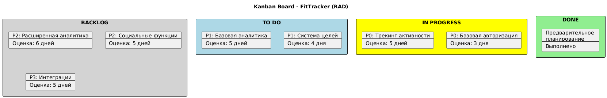

# Отчет по проекту "FitTracker" (RAD методология)

## 1. Тема проекта
Разработка мобильного приложения для отслеживания физической активности и здорового образа жизни.

### Решаемые задачи:
* Отслеживание тренировок
* Ведение дневника питания
* Установка целей
* Получение персональных рекомендаций

## 2. Функциональные требования

### Высокий приоритет:
1. Регистрация/авторизация пользователей
    - Email/password
    - OAuth 2.0 (Google, VK)
    - Профиль пользователя

2. Трекинг активности
    - Запись тренировок
    - Подсчет шагов
    - Измерение дистанции
    - Расчет сожженных калорий

3. Дневник питания
    - База продуктов
    - Калькулятор калорий
    - Дневной рацион
    - Водный баланс

### Средний приоритет:
4. Цели и достижения
    - Установка целей
    - Отслеживание прогресса
    - Система достижений
    - Уведомления

5. Аналитика
    - Графики прогресса
    - Статистика активности
    - Отчеты по питанию

### Низкий приоритет:
6. Социальные функции
    - Делиться достижениями
    - Соревнования
    - Рейтинги

## 3. Этапы реализации (RAD)

### 1. Предварительное планирование (1 неделя)
- Определение бизнес-целей
- Формирование команды
- Выбор инструментов

### 2. Анализ и дизайн пользовательского взаимодействия (2 недели)
- Создание пользовательских сценариев
- Прототипирование интерфейса
- Утверждение с заказчиком

### 3. Циклическая разработка (12 недель, 4 цикла по 3 недели)

#### Цикл 1: Базовый функционал
- Авторизация
- Основной трекинг активности
- Базовый дневник питания

#### Цикл 2: Расширенные функции
- Расширенная аналитика
- Система целей
- Расширенный дневник питания

#### Цикл 3: Аналитика и отчеты
- Графики и статистика
- Персональные рекомендации
- Уведомления

#### Цикл 4: Дополнительный функционал
- Социальные функции
- Геймификация
- Интеграции

### 4. Финализация (3 недели)
- Комплексное тестирование
- Оптимизация производительности
- Подготовка к релизу

## 4. Декомпозиция и приоритизация задач

### Приоритет P0 (Must Have):
1. Базовая авторизация (3 дня)
2. Трекинг активности (5 дней)
3. Базовый дневник питания (4 дня)
4. Профиль пользователя (2 дня)

### Приоритет P1 (Should Have):
5. Расширенная авторизация (3 дня)
6. Система целей (4 дня)
7. Базовая аналитика (5 дней)
8. Уведомления (3 дня)

### Приоритет P2 (Could Have):
9. Расширенная аналитика (6 дней)
10. Социальные функции (5 дней)
11. Система достижений (4 дня)

### Приоритет P3 (Nice to Have):
12. Интеграции со сторонними сервисами (5 дней)
13. Расширенная геймификация (4 дня)

## 5. Обоснование приоритизации

### Критерии приоритизации:
1. Базовая функциональность (P0)
    - Необходима для работы приложения
    - Обеспечивает ключевую ценность для пользователя

2. Расширенная функциональность (P1)
    - Улучшает пользовательский опыт
    - Повышает удержание пользователей

3. Дополнительные функции (P2)
    - Повышают конкурентоспособность
    - Создают дополнительную ценность

4. Опциональные функции (P3)
    - Улучшают продукт
    - Не критичны для основного функционала

## 6. Kanban board

