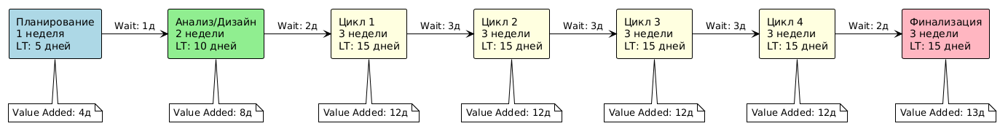
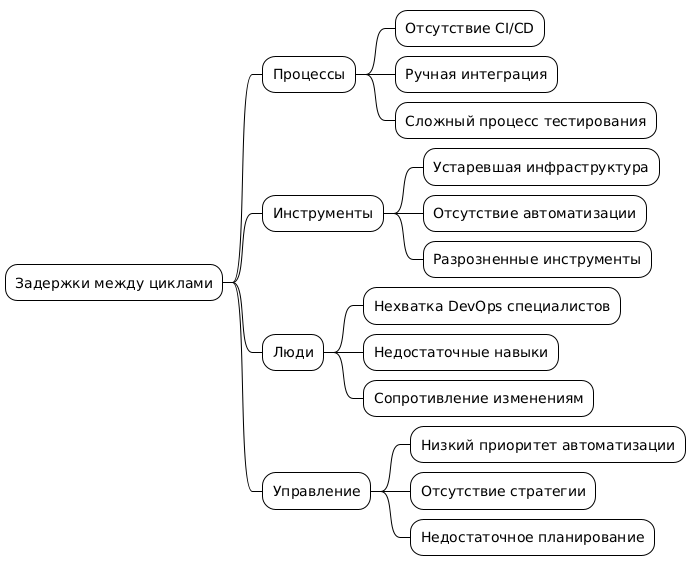

# Анализ процесса разработки проекта "FitTracker" (RAD методология)

## 1. Анализ текущего процесса

### Основные этапы RAD:
1. Предварительное планирование (1 неделя)
2. Анализ и дизайн (2 недели)
3. Циклическая разработка (12 недель, 4 цикла по 3 недели)
4. Финализация (3 недели)

### Выявленные проблемные зоны:
- Возможные задержки между циклами разработки
- Риск потери фокуса на приоритетных функциях
- Сложности в оценке готовности промежуточных результатов
- Проблемы с интеграцией компонентов
- Недостаточная вовлеченность заказчика

## 2. Value Stream Mapping

### Текущий поток создания ценности:

## 3. Метрики

* Общее время цикла: 90 дней
* Время добавления ценности: 73 дня
* Время ожидания: 17 дней
* Efficiency Ratio: 81%

## 4. Fishbone Diagram

## 5. Предложения по улучшению

### Процессы:
1. Внедрение CI/CD пайплайна
    * Автоматизация сборки проекта
    * Настройка автоматического деплоя
    * Внедрение автоматических проверок качества кода

2. Автоматизация тестирования
    * Разработка фреймворка автотестов
    * Внедрение unit-тестирования
    * Настройка интеграционного тестирования

3. Оптимизация процесса код-ревью
    * Внедрение стандартов кодирования
    * Автоматические проверки стиля кода
    * Установка четких критериев приемки кода

### Инструменты:
1. Внедрение Docker для разработки
    * Создание Docker-образов для разработки
    * Настройка Docker Compose
    * Документирование процессов

2. Настройка Jenkins/GitLab CI
    * Создание пайплайнов
    * Настройка автоматических сборок
    * Интеграция с системой контроля версий

3. Единая система управления зависимостями
    * Выбор package manager
    * Настройка версионирования
    * Централизованное управление библиотеками

### Люди:
1. Найм DevOps инженера
    * Составление требований
    * Проведение собеседований
    * Онбординг специалиста

2. Обучение команды автоматизации
    * Разработка программы обучения
    * Проведение воркшопов
    * Практические занятия

3. Развитие культуры DevOps
    * Внедрение лучших практик
    * Регулярные митинги по улучшению процессов
    * Поощрение инициатив по автоматизации

### Управление:
1. Выделение ресурсов на автоматизацию
    * Оценка необходимых ресурсов
    * Планирование бюджета
    * Распределение задач

2. Разработка стратегии DevOps
    * Определение целей
    * Разработка метрик
    * План внедрения

3. Измерение метрик эффективности
    * Определение KPI
    * Внедрение систем мониторинга
    * Регулярная отчетность

## 6. План действий

### Краткосрочные действия (1-3 месяца)

| Улучшение | Ответственный | Срок | Приоритет | Статус |
|-----------|---------------|------|-----------|---------|
| Внедрение CI/CD | DevOps Engineer | 3 недели | Высокий | Планируется |
| Автоматизация тестов | QA Lead | 4 недели | Высокий | Не начато |
| Настройка Docker | DevOps Engineer | 2 недели | Средний | Не начато |
| Обучение команды | Team Lead | 4 недели | Средний | Не начато |
| Метрики эффективности | Project Manager | 2 недели | Низкий | Не начато |

### Среднесрочные действия (3-6 месяцев)

| Улучшение | Ответственный | Срок | Приоритет | Статус |
|-----------|---------------|------|-----------|---------|
| Развитие культуры DevOps | CTO | 3 месяца | Средний | Планируется |
| Улучшение мониторинга | DevOps Engineer | 2 месяца | Средний | Не начато |
| Оптимизация процессов | Team Lead | 3 месяца | Низкий | Не начато |

### Долгосрочные действия (6-12 месяцев)

| Улучшение | Ответственный | Срок | Приоритет | Статус |
|-----------|---------------|------|-----------|---------|
| Полная автоматизация | CTO | 6 месяцев | Низкий | Не начато |
| Масштабирование инфраструктуры | DevOps Engineer | 8 месяцев | Низкий | Не начато |

### Ожидаемые результаты:

#### Количественные показатели:
- Сокращение времени между циклами на 50%
- Ускорение процесса интеграции на 70%
- Снижение количества ошибок при деплое на 90%
- Увеличение скорости разработки на 30%

#### Качественные показатели:
- Повышение качества кода
- Улучшение предсказуемости релизов
- Повышение удовлетворенности команды
- Упрощение процесса онбординга новых сотрудников

### Риски:

| Риск | Вероятность | Влияние | Митигация |
|------|-------------|---------|-----------|
| Сопротивление команды | Высокая | Среднее | Постепенное внедрение, обучение |
| Технические сложности | Средняя | Высокое | Привлечение экспертов, пилотные проекты |
| Превышение сроков | Средняя | Среднее | Буфер времени, четкие приоритеты |